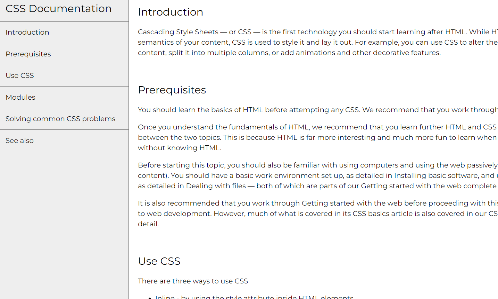

# Technical Documentation Page
This is an HTML document representing a technical documentation page about CSS. It provides information and resources related to Cascading Style Sheets.

## Preview

## Table of Contents
- [Introduction](#introduction)
- [Prerequisites](#prerequisites)
- [Use CSS](#use-css)
- [Modules](#modules)
- [Solving Common CSS Problems](#solving-common-css-problems)
- [See Also](#see-also)
- [How to View the Page](#How-to-View-the-Page)
- [Contributions](#contributions)
- [Credits](#credits)

## Introduction
The introduction section provides an overview of CSS and its role in styling and layout. It explains how CSS is used to alter the font, color, size, spacing, and other visual aspects of HTML content.

## Prerequisites
The prerequisites section outlines the recommended prior knowledge before learning CSS. It suggests learning the basics of HTML first and being familiar with using computers and the web passively. It also references additional resources for getting started with web development.

## Use CSS
The use CSS section describes the different ways to use CSS: inline, internal, and external. It provides examples and code snippets for each method, demonstrating how to apply CSS styles to HTML elements.

## Modules
The modules section presents a suggested order for working through different CSS modules. It provides descriptions of each module, including "CSS first steps," "CSS building blocks," "CSS styling text," and "CSS layout." Each module focuses on different aspects of CSS, progressing from fundamentals to more advanced topics.

## Solving Common CSS Problems
In this section, common CSS problems are addressed, and CSS solutions are provided. It emphasizes the versatility of CSS and how it can be used to solve various challenges in web page design and styling.

## See Also
The "See Also" section includes a link to the Mozilla Developer Network (MDN) CSS documentation. It serves as a comprehensive reference for CSS, providing detailed documentation on CSS features and properties.

## How to View the Page
You can view the page by opening the index.html file in your web browser. The page is designed to be responsive, so it should look good on any device.

## Contributions
Contributions to the project are welcome. Feel free to submit a pull request with any improvements or fixes.

## Credits
- HTML and CSS code written by Kalutu Daniel.
- Page content sourced from MDN Web Docs.
- Readme created by Kalutu Daniel.
